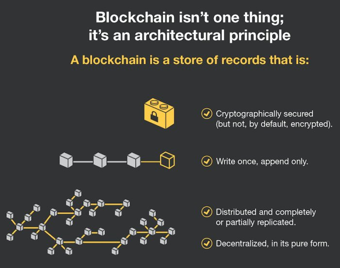
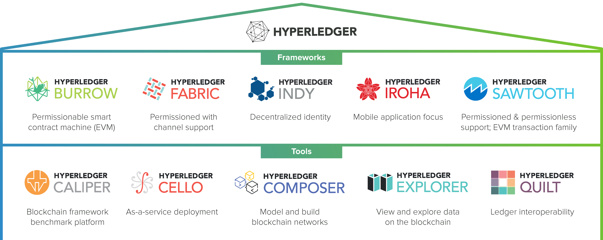
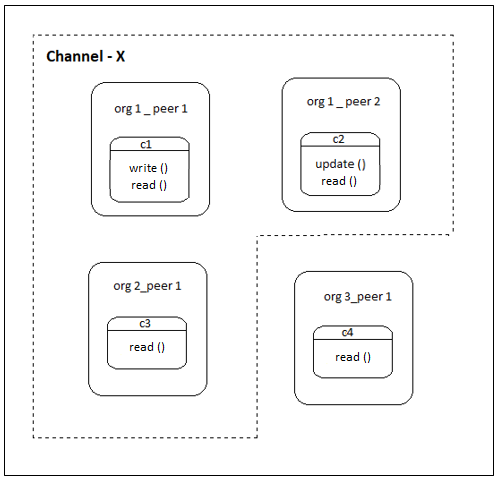

# 1. 블록체인 이해하기

## 1.1 블록체인이란?

### 1.1.1 분산 원장
분산원장 `distributed ledger`은 블록체인을 구성하는 가장 중요한 요소 중 하나다.
또한, 블록체인을 탈중앙화된 시스템으로 만들어 주는 핵심 기술이다.

블록체인에 참여하는 모든 사람이 동일한 원장을 소유하고 관리하는 기술이다.

블록체인 분산원장은 모든 정뽀가 해시화되어 append-only 방식으로만 원장에 저장된다.
그래서 한번 원장에 기록된 정보들은 절대 수정할 수 없다. 즉, 불가변성`immutability`의 특성을 가진다.
    
   
  
   [그림1] 블록체인의 append-only 저장방식

### 1.1.2 스마트 컨트랙트
블록체인 잠여자는 스타므 컨트랙트 `smart contract`를 통해서 분산 원장에 정보를 기록하거나 읽을수 있다.
또한 스마트 컨트랙트를 이용하여 단순히 거래정보를 읽고 쓰는 것뿐만 아니라 프로그래밍을 통해 거래 자동화 등의 다양한 응용프로그램을
만들 수도 있다.

스마트 컨트랙트를 좀 더 편리하게 사용하기 위해 개발되는 프로그램을 분산 애플리케이션 `decentralized application, (DApp)`
이라고 한다.

### 1.1.3 합의
블록체인에 참여한 모든 노드 중 암호화된 퍼즐의 답을 가장 먼저 찾아내는 노드의 블록을 최신 블록으로 업데이트하는 `PoW (Proof of Work)` 방식있다.
그외 `PoS`, `BFT`와 같은 합의 알고리즘이 있다.

Hyperledger Fabric에서는 조금 다른 관점으로 합의 알고리즘을 정의한다.

- 보증 정책 확인
- 트랜잭션을 정해진 순서에 맞춰 정령
- 정렬된 트랜잭션의 유효성 검증 후 최신 블록 업데이트

## 1.2 블록체인은 어떻게 사용될 수 있을까
### 1.2.1 오늘날의 비즈니스 모델

오늘날 대부분의 비즈니스 모델에서는 신뢰성 있는 거래를 위해 중개자 `intermediary`가 필요하다.

### 1.2.2 블록체인 비즈니스 모델

블록체인 비즈니스 모델에서는 중개자가 없기 때문에 중개 수수료를 절감함과 동시에 하나의 일관된 시스템에서
거래가 발생하므로 자산 증명에 대한 시간과 비용을 절약할 수 있다.

## 1.3 Hyperledger Fabric 소개
### 1.3.1 Hyperledger 프로젝트 소개

2015년, 리눅스 재단에서는 기업용 블록체인 개발을 위해 Hyperledger 프로젝트를 만들었는데, 오픈소스 형태의 프로젝트이다.

Hyperledger Project는 다음과 같이 크게 나눠진다.
- Hyperledger Frameworks
- Hyperledger Tools

#### 하이퍼레저 프레임워크
Hyperledger Frameworks는 분산원장, 스마트 컨트랙트, 합의 알고리즘 등 블록체인에 대한 원천적인 기술을 개발하는 프로젝트이다.

[그림2] 하이퍼레저 프레임워크와 툴

- Hyperledger Fabric 
    > 가장 활발하게 활동 중인 하이퍼레저 프로젝트로서 IBM이 제공한 44,000줄의 코드 기반으로 개발되고 있다. MSP `membership service provider`
    기반의 접근 제어 기능을 제공하고  트랜잭션을 블록에 정렬한 후 합의하는 방법으로 현재 Solo, Kafka, SBFT(향후 개발 예정)있다.
    
- Hyperledger Sawtooth
    > Intel의 Intel Distributed Ledger 를 바탕으로 개발되었으며 SGX `secure guard extension`을 이용해 구현한 PoET(Proof of Exlapsed Time)
    합의 알고리즘을 사용한다.
    
#### 하이퍼레저 툴
하이퍼레저 툴 `Hyperledger tools`은 블록체인 시스템의 성능 측정, 운영, 개발을 쉽게 할수 있도록 도와주는 툴을 개발하는 프로젝트이다.

대표적으로 Caliper, Cello, Explorer 등이 있다.

### 1.3.2 하이퍼레저 패브릭 개요
하이퍼레저 패브릭은 가장 왕성하게 활동 중인 하이퍼레저 프로젝트이다.
`허가형 프라이빗 블록체인(Permissioned and Private Blockchain)` 형태로 개발되었으며, 이더리움, 비트코인 등 누구나 참여할 수 있는
퍼블릭 블록체인과는 달리 `MSP(Membership Service Provider)`라는 인증 관리 시스템에 등록된 사용자만이 블록체인에 참여할 수있다.

`채널(channel)`이라는 개념을 도입해서 블록체인 참여자들 간의 프라이버시를 강화했다.

   

    

