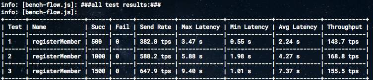
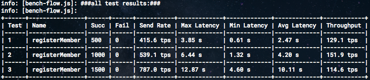
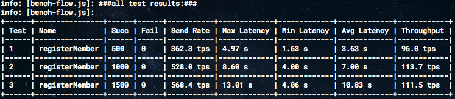
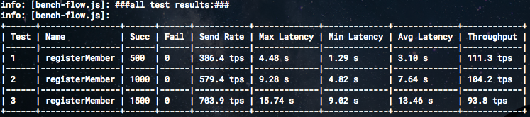

# Batch Timeout에 따른 성능 비교

1. 테스트 환경:
    - CPU: Intel Core i7-4870HQ @ 2.50GHz
    - Memory: 16 GB
    - Hyperledger Fabric v1.4.7 RAFT (5 Orderers, 4 Peers, 3 CA)
    - TestTool: https://github.com/hyperledger/caliper
    

2. 테스트 목적:
   - Batch Timeout 변경으로 인한 성능 테스트
   - `configtx.yaml` > Orderer > BatchTimeout 변경
    
        ```yaml
        ...
        Orderer: &OrdererDefaults
          OrdererType: etcdraft
          Addresses:
            - orderer0.xxxx.com:7050
          BatchTimeout: 250ms # 이 부분 변경
          BatchSize:
            MaxMessageCount: 10
        ...
        ```
    
    - Batchtimeout을 250ms / 500ms / 1s / 2s  로 변경 (기본값: 2s)
    - cf.) https://hyperledger-fabric.readthedocs.io/en/release-1.4/config_update.html?highlight=batch%20Timeout#editing-a-config
    - `configtxgen`으로 genesis.block, channel.tx. orgpanchors.tx 생성후 테스트


3. 테스트 결과:
    - 250ms (168.8 tps)
    
      
    - 500ms (151.9 tps)
    
      
    - 1s (113.7 tps)
    
      
    - 2s (111.3 tps)
    
