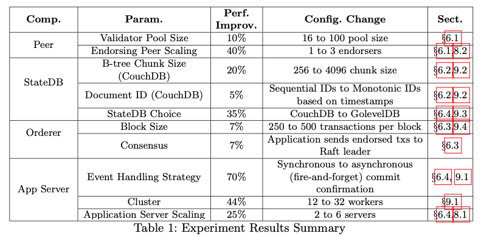
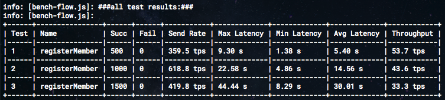
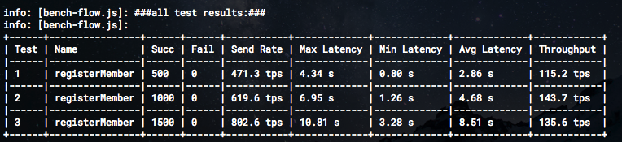
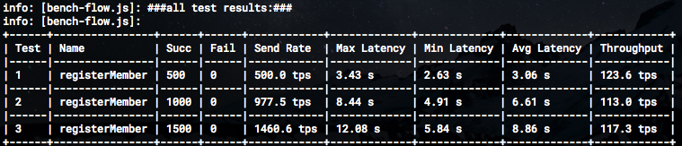
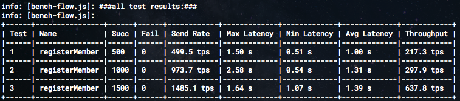

# StateDB 성능비교
CouchDB vs GoLevelDB

## 1. 테스트 목적:
[Performance Tuning and Scaling Enterprise Blockchain Applications](https://arxiv.org/pdf/1912.11456.pdf) 논문 중

CouchDB → GolevelDB 변경 시 35% 성능향상있다고 함.

## 2. 결과:
- 테스트 환경:
  - CPU: Intel Core i7-4870HQ @ 2.50GHz
  - Memory: 16 GB
  - Hyperledger Fabric v1.4.7 RAFT (5 Orderers, 4 Peers, 3 CA)

- Fabric SDK - CouchDB: (43.6tps)

- Fabric SDK - LevelDB: (143.7tps, CouchDB 대비 약 3.3배 차이남)

- Transaction Batch Processor - CouchDB: (117.3tps)

- Transaction Batch Processor - LevelDB: (637.8tps, CouchDB 대비 약 5.4배 차이남)

