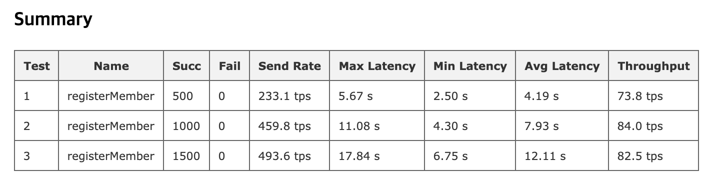

# Execute Order Validate vs Raft Consensus

1. Kafka (Execute Order Validate)
- 테스트 환경: m5.large(11 instances), 3 CA, 3 Kafka, 3 Zookeepers, 4 Orderers, 4 Peers
- 결과:
  
  
2. Raft
- 테스트 환경: m5.large(11 instances), 3 CA, 5 Orderers, 4 Peers
- 결과:
  

