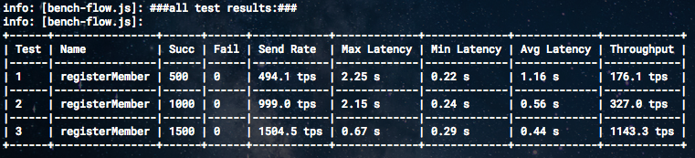
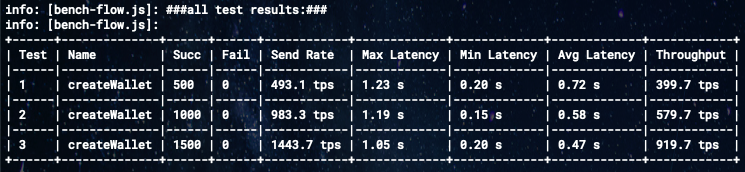

# HF v1.4 vs v2.2 성능비교
Hyperledger Fabric v1.4 vs v2.2

## 1. 테스트 목적:
Hyperledger Fabric New LTS Version(v2.2) Release 으로 인한 성능 테스트 진행

## 2. 결과:
- 테스트 환경:
  - Instance Type: m5.4xlarge
  - CPU: 16 ECU, 4 vCPUs, 3.1 GHz, Intel Xeon Platinum 8175
  - Memory: 64 GB
  - Hyperledger Fabric v1.4.7 RAFT
  - Hyperledger Fabric v2.2.2 RAFT
  - BatchTimeout: 1s
  - 3 CA, 5 Orderers, 4 Peers

- Hyperledger Fabric v1.4.7 with LevelDB and TxBooster: (176 ~ 1143tps)
  

- Hyperledger Fabric v2.2.2 with LevelDB and Txbooster: (399 ~ 919tps)
  
