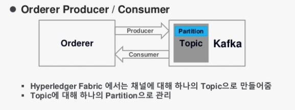

# Hyperledger Korea UserGroup Meetup 
## 2019년 02월 19일

## 주제
* Orderer & Kafka

## Orderer와 Kafka의 관계
Orderer는 HF Network의 합의 알고리즘 처리하는 컴포넌트

* ESCC 이후 Transaction Ordering 처리

* (AS-IS) SOLO, Kafka 

* (TO-BE) SOLO, Kafka, RAFT, SBFT 

* HF Network 구성 채널의 선착순 정렬

* 블록생성 시간(BatchTimeout)과 BatchSize에 의해 블록 생성

* 블록 당 트랜잭션 개수(BatchSize)는
  - MaxMessageCount 
  - AbsoluteMaxBytes
  - PreferreMaxBytes

* Orderer Producer & Consumer

## 성능 개선 방안
* Golang 은 Core가 많을 수록 병렬 처리가 가능 
* BlockChain File과 LevelDB or CouchDB를 단일 시스템에서 운용하면 DISK IO로 인한 CPU 성능 저하 
* Block 생성 조건을 이용한 튜닝  PBFT > Zyzzyva > SBPF 네트워크 부하 개선 
* Blockchain = 분산DB / chaincode = SQL 
* Docker 가상화? 성능 향상? 흠.

참고: https://docs.google.com/document/d/19JihmW-8blTzN99lAubOfseLUZqdrB6sBR0HsRgCAnY/edit

