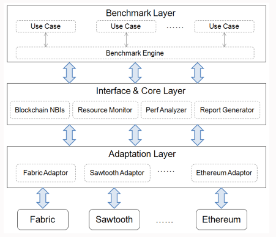

# Hyperledger Korea UserGroup Meetup 
## 2019년 05월 24일

## 주제
* Hyperledger 재단 소개와 글로벌 유스 케이스
* 하이퍼레저 패브릭 1.4 기반의 캘리퍼 분산테스팅 환경 구축하기

## 자료
* 사전 작업 자료 - https://github.com/hlkug/meetup/blob/master/201905/사전%20작업.md
* VM 다운로드 - http://bit.ly/2HxdyzY
* 발표 자료 - https://www.slideshare.net/secret/AcV4X3sHYDvzj7

### Caliper
* GIT Remote: https://github.com/hyperledger/caliper
* 블록체인 성능을 테스트 하기 위한 벤치마크 도구
* 지원되는 성능지표
  - 성공률
  - Tx 처리량
  - Tx 대기시간
  - 리소스 사용률
  
### 아키텍처

* Adaption Layout
  - 블록체인 시스템을 프레임워크로 연동
  
* Interface & Core Layer
  - Blockchain NBIs
    - 스마트 컨트랙트 deploy, 계약서 호출, 원장으로부터 쿼리 상태를 가져오는 등의 오퍼레이션 수행 
  - Resource Monitor 
    - 백엔드 블록체인 시스템의 리소스 상태 (CPU, memory, network IO 등)를 가져옴 
  - Performance Analyzer 
    - 미리 정의된 performance statistics (TPS, 지연, 성공률 등)를 읽어 들이고 벤치마크 결과들을 출력 
  - Report Generator 
    - 테스트 리포트를 생성 (HTML 형식) Application Layer 블록체인 시스템 성능 측정을 위한 테스트 (백엔드 블록체인 네트워크, 벤치마크 등이 정의된 설정 파일 이용)
  
### 느낀점
회사 업무 차원 이미 커스텀마이징을 해서 잘 알고 있지만,
나도 발표하면 떨리겠지...

나도 사진에 나왔다ㅋㅋ
