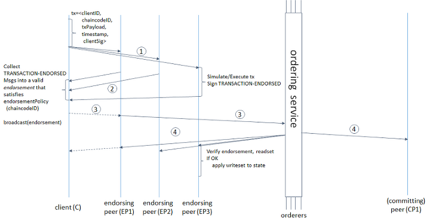

# Hyperledger Korea UserGroup Meetup 
## 2019년 08월 22일

## 주제
* Hyperledger Fabric 소개 및 첫 네트워크 구축하기

## 자료
- 사전 작업 자료 - https://github.com/hlkug/meetup/blob/master/201908/사전%20작업.md
- 발표 자료 - https://www.slideshare.net/secret/MUYjHNs2Pqx7r1
- 실습 자료 - https://github.com/hlkug/meetup/blob/master/201908/핸즈온%20랩.md

## Hyperledger Fabric 소개 및 첫 네트워크 구축하기

### Public vs Private

|   | 퍼블릭 블록체인 | 컨소시엄(프라이빗) 블록체인 |
|---|---|---|
|관리 주체|모든 거래 참여자|컨소시엄에 속한 참여자|
|데이터 접근|누구나 접근 가능|허가 받은 사용자만 접근|
|합의 알고리즘|PoW, PoS 등|PBFT 등 |
|보상/수수료|O|X|
|구현 사례|Bitcoin, Ethereum, 등|Hyperledger Fabric, R3 Corda, 등|

### Hyperledger Fabric의 특징
* Linux Foundation에 의해 설립된 오픈 소스 프로젝트 
* 초기 IBM이 제공한 코드를 기반으로 현재 30여 조직에서 개발 참여 중 
* 모듈화 및 구성이 가능한 아키텍처 
* 범용 프로그래밍 언어로 작성된 Smart Contract(Chaincode)를 지원하는 최초의 분산 원장 플랫폼 
  - Go, Node.js, Java 
* 허가형 블록체인(Permissioned Blockchain) 
* 플러그 가능 컨센서스 프로토콜을 지원 
* 암호 화폐 불필요 
* 개인 정보 보호 및 기밀성 유지

### Hyperledger Fabric 구성 요소
* 채널(Channel) 
* 조직(Organization) 
* 피어(Peer) 
* 오더러(Orderer) 
* 원장(Ledger) 
* 체인코드(Chaincode)

### 합의 알고리즘
Endorsing - Ordering - Validating

- Endorsing 에서는 보증역할을 맡은 peer들이 트랜잭션에 대해 실행을 하고 결과 값 사인한후에 client에 리턴 (peer 간 커뮤니케이션 X) 
- Orderer에 특정 값을 전달하면 Orderer는 Tx에 순서를 정하고 블록 생성 
- Validator 에게 전달하면 Validatior에서는 보증 확인 후 Ledger에 기록

### 후기
한번 더 기초를 다진 느낌.
