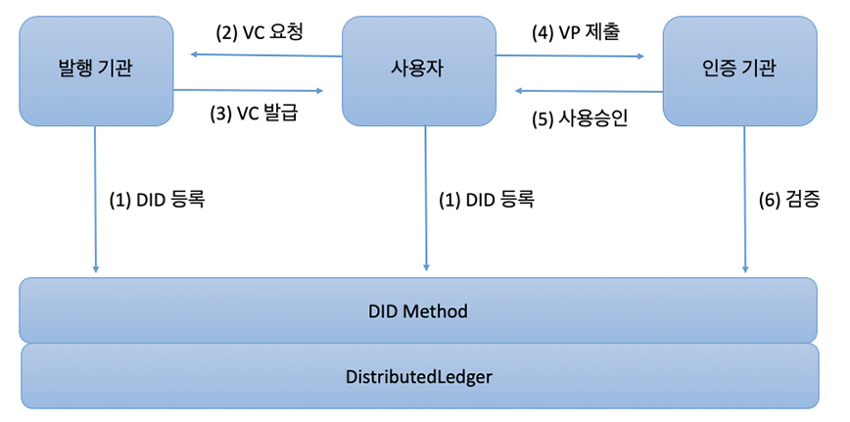
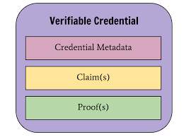
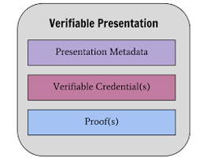

# Hyperledger Korea UserGroup Meetup 
## 2019년 10월 17일

## 주제
* DID(Decentralized Identity) 그리고 Hyperledger Indy - Getting Started

## 자료
- 사전 작업 자료 - http://bit.ly/hlpre_19
- 발표 자료 - https://www.slideshare.net/secret/cWV119m8ENRDWL
- 실습 자료 - https://github.com/hlkug/meetup/blob/master/201910/핸즈온%20랩.md

## DID(Decentralized Identity) 그리고 Hyperledger Indy - Getting Started

### Self Sovereign Identity(자기 주권 신원)
* 행정당국의 개입 없이!!
* 개인이 자신의 신분을 소유하고 통제해야 한다는 것!

### DID(Decentralized Identity)
* 실생활에서 본인이 자신의 지갑에서 신원정보를 관리하는 것처럼 
* 온라인에서도 스스로 자신의 신원정보를 관리・통제할 수 있도록 하는 디지털화된 신원 관리 체계

### DID 검증 과정

### VC & VP
사용자가 자신의 신원 정보(Verifiable Credentials)을 보유한 주체로, 해당 신원 정보 기반의 제공 데이터(Verifiable Presentations)을 생성한다.

* 사용자가 Issuer로부터 발급 받는 VC는 사용자의 단말(Edge Wallet)이나 클라우드 서비스(Cloud Wallet)에 보관 된다.
* VC에는 발급자, 만료일, 사용자 관련 assertion, 서명 값 등이 포함되어 있다. 
* 이후에 사용자가 서비스 이용 하는 과정에서 Verifier(=서비스 제공자)는 사용자에게 VC 정보를 요청할 수 있다.

* 이 때, 사용자는 요청된 정보들 중에서 본인이 전달하고 싶은 정보에 해당하는 VC들만 선택한 후 
* VP (Verifiable Presentation) 이라는 형식의 데이터를 SP에게 제출하여 인증을 수행하게 된다. 
* Verifiable Presentation는 VC를 복수 개 이상 포함할 수 있으며 
* Verifiable Presentation에 포함되는 VC들이 모두 본인 것 임을 증명하기 위한 사용자 추가 서명을 포함하고 있다. 

