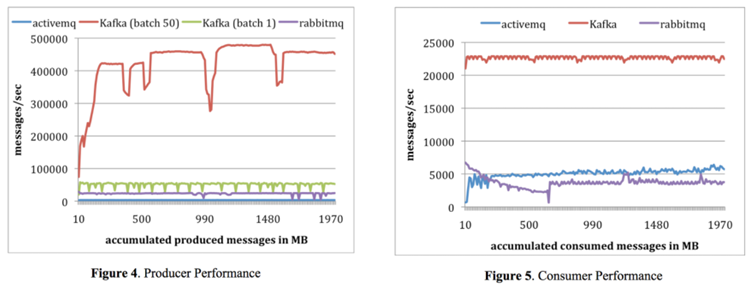

# Apache Kafka

#### 목차
- Kafka가 무엇인가요?
- 

## Kafka가 무엇인가요? (1)

- [Apache Kafka® is a distributed streaming platform](https://kafka.apache.org/intro)
- 말 그대로 `분산 스트리밍 플랫폼`, LinkedIn 에서 구직 + 채용 정보들을 한곳에서 처리(발행/구독)할수 있는 플랫폼으로 개발이 시작
- 분산된 형태로 돌아가는 `publish-subscribe 방식` 메시지 교환 시스템 
     > Publish: 데이터를 생성, Subscribe: 해당 데이터를 읽어 소비
- 메시지를 기본적으로 메모리에 저장하는 기존 메시징 시스템과는 달리 메시지를 파일 시스템에 저장 
     > 카프카 재시작으로 인한 메세지 유실 우려 감소

  
## Kafka가 무엇인가요? (2)

- 기본 개념
    * 여러 데이터센터로 확장할 수 있는 하나 혹은 그 이상의 서버에서 클러스터로 실행(수행/운영)된다
    * 카프카 클러스터는 레코드(records)라는 스트림을 토픽(topics)이라고 불리는 카테고리에 저장
    * 각각의 레코드는 키(a key,), 값(a value), 타임스탬프(a timestamp)로 구성

- 분산된 형태로 동작하는 changelog
    * Key 값에 할당된 Value 값들에 대한 변경 내역을 분산된 형태로 저장한다
    * 저장된 Key-Value 들을 분배한다.
    
    
    